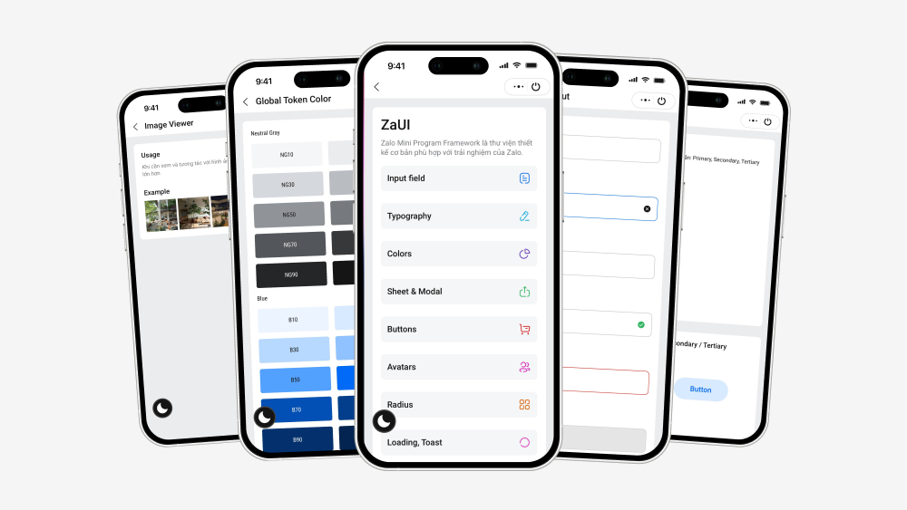

# Zalo UI

[](https://nodejs.org/en/download/package-manager) [](https://vite.dev) [](https://vite.dev)



## Setup

### Terminal Commands

1. [Install Node JS](https://nodejs.org/en/download/)
1. [Install Android Studio](https://developer.android.com/studio/)
1. [Install Xcode](https://developer.apple.com/xcode/)
1. [Install Java Development](https://www.oracle.com/java/technologies/downloads/)
1. Download or clone this repository
1. Install dependencies

    ```bash
    npm install
    ```

1. Start on Android

    ```bash
    npm run android
    ```

1. Start on IOS

    ```bash
    npm run ios
    ```

## Usage:

Folder structure:

-   **`assets`**: Fonts, Icons SVG, Images that should be imported directly into bundle source code.
-   **`components`**: Reusable components written in React.JS.
-   **`constants`**: Constants colors, dimensions in App.
-   **`navigation`**: Navigation setup, define navigators and router.
-   **`screens`**: Holds the main screens of application.
-   **`themes`**: Dark/Light theme of application.
-   **`types`**: Contains TypeScript type and interface declarations.
-   **`utils`**: Utility functions/helpers.

The other files (such as `.prettierrc`, `tsconfig.json`, `react-native.config.js`) are configurations for libraries used in your application. Visit the library's documentation to learn how to use them.